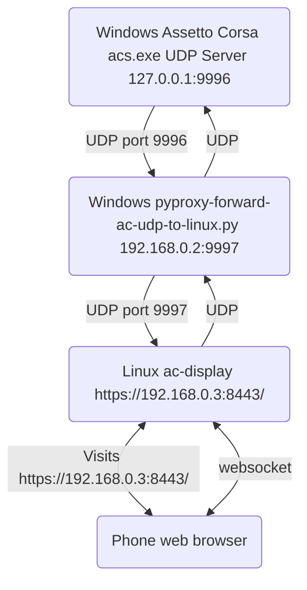

## About

1. This is just a proof of concept to show an RPM gauge and some stats from Assetto Corsa, on a second monitor, another computer, a phone, or tablet. The idea would be that the other device sits above your wheel and then you can turn off the in game dash or change the position of the camera to show less dash and more road.
2. I am not a web designer. I like minimal web pages, but I am no web expert, the web interface is usable but ugly and janky, I know just enough to be dangerous.
3. Getting this up and running is a bit of a pain and you'll need to know a little bit about networking, good luck!


[](https://www.youtube.com/watch?v=C6pQ46W23wA)  
[Demonstration Video on Youtube](https://www.youtube.com/watch?v=C6pQ46W23wA)


## Third Party Libraries and Resources

- [libjson-c](https://github.com/json-c/json-c)  
- [libmicrohttpd](https://www.gnu.org/software/libmicrohttpd/)  
- [acudp](https://github.com/vpicon/acudp)  
- [pyproxy](https://github.com/rsc-dev/pyproxy/)
- [Javascript RPM gauge](https://geeksretreat.wordpress.com/2012/04/13/making-a-speedometer-using-html5s-canvas/)
- [Disconnection icon](https://www.svgrepo.com/svg/332225/api)
- [Fullscreen icon by Automattic, SVG Repo, GPL](https://www.svgrepo.com/svg/335073/fullscreen)
- [Gauge icon by romzicon, Noun Project, CC BY 3.0](https://thenounproject.com/browse/icons/term/gauge/)

## Build

Install dependencies:

Ubuntu:
```bash
sudo apt install automake autoconf libtool texinfo gcc-c++ cmake json-c-dev libxml2-dev gtest-dev
```

Fedora:
```bash
sudo dnf install automake autoconf libtool texinfo gcc-c++ cmake json-c-devel libxml2-devel gtest-devel
```

Build:
```bash
$ (cd acudp && ./build.sh)
$ (cd libmicrohttpd && ./build.sh)
$ cmake .
$ make -j
```

## Run the Unit Tests

```bash
$ ./unit_tests
```

## Validate Static HTML

```bash
$ xmllint --noout resources/index.html # Should be no output
$ echo $? # Should print 0
```


## IP Addresses

| Machine        | OS           | IP Address  |
| ------------- | ------------- | ------------- |
| Assetto Corsa | Windows | 192.168.0.2 |
| ac-display | Linux | 192.168.0.3 |
| Monitor or Device | Web Browser (Second monitor/computer/phone/tablet) | 192.168.0.x |

## Data Flow



## Usage

### On Assetto Corsa Machine (Windows)

On the computer running :
1. Open file `C:\Program Files (x86)\Steam\steamapps\common\assettocorsa\system\cfg\assetto_corsa.ini` with notepad.
2. Find line `ENABLE_DEV_APPS=0` and change it to `ENABLE_DEV_APPS=1`
3. Save the file
4. Open UDP port 9996 on the Windows firewall, or change the network profile to Private
5. Forward the AC UDP traffic to the rest of the network, in a git-bash, VSCode terminal, or similar (Change the IP and port):
```bash
python .\pyproxy-forward-ac-udp-to-linux.py -d 192.168.0.2:9997 -v
```

### On ac-display Machine (Linux)

1. Optionally generate self signed certificates for TLS:
```bash
openssl genrsa -out server.key 2048
openssl rsa -in server.key -out server.key
openssl req -sha256 -new -key server.key -out server.csr -subj '/CN=localhost'
openssl x509 -req -sha256 -days 365 -in server.csr -signkey server.key -out server.crt
```
2. Set up a configuration.json file by copying the example and editing it (Set your source and destination addresses and ports, use "0.0.0.0" for the "https_host" field if you are running ac-display in a container because it doesn't know about the external network interfaces, optionally set the the server.key and server.crt):
```bash
cp configuration.json.example configuration.json
vi configuration.json
```
3. Open ports in firewalld (Replace 9997 and 7080 with your ports):
```bash
sudo firewall-cmd --permanent --add-port=9997/udp
sudo firewall-cmd --permanent --add-port=7080/tcp
sudo firewall-cmd --reload
```

#### Run ac-display natively

1. Run ac-display:
```bash
./ac-display
```

#### OR, in a podman rootless container

1. Install dependencies:
```bash
sudo dnf install podman slirp4netns
```
2. Build the container:
```bash
podman build --tag fedora:acdisplay -f ./Dockerfile
```
3. Run the container (Replace the IP and port with your own):
```bash
podman run -p 192.168.0.3:9997:9997/udp -p 192.168.0.3:7080:7080 --shm-size 256m --name acdisplay --rm fedora:acdisplay
```

### On a Monitor or Device on the Same Network (Second monitor/computer/phone/tablet)

1. Go to the address in a browser (Replace the address and port):  
`https://192.168.0.3:7080/`
2. If you are seeing a "Disconnected" message on the page then press F12 and click on "Console" to check if there are any useful error messages

## Fuzzing

### Fuzz the web server

**Note: This is super slow because we have to create a web server each time, and perform one request, that isn't too slow, but then we have to clean up which means requesting that any connect client threads exit, waiting for them to exit and generally cleaning up**  
Though, we can probably do some smarter checking in the web server clean up code and avoid waiting as long.

```bash
cd fuzz
make
mkdir -p ./corpus/fuzz_web_server_https_url/
./fuzz_web_server_https_url -runs=500000 -max_len=10000 -workers=2 -fork=1 -shrink=1 ./corpus/fuzz_web_server_https_url
```

```bash
cd fuzz
make
mkdir -p ./corpus/fuzz_web_server_https_request/
./fuzz_web_server_https_request -runs=500000 -max_len=10000 -workers=2 -fork=1 -shrink=1 ./corpus/fuzz_web_server_https_request
```

### Merge corpuses (Unless you create a new empty corpus directory you won't need this)

Merge items from corpus 2, 3, ... into corpus 1
```bash
rm -f ./MergeStatusControlFile
./fuzz_web_server_https_url corpus/fuzz_web_server_https_url/ corpus/new_items/ -merge=1 -merge_control_file=MergeStatusControlFile
```

## Reference

https://www.scribd.com/document/629251050/ACRemoteTelemetryDocumentation

<details>
<summary>Development History in Images</summary>


</details>
